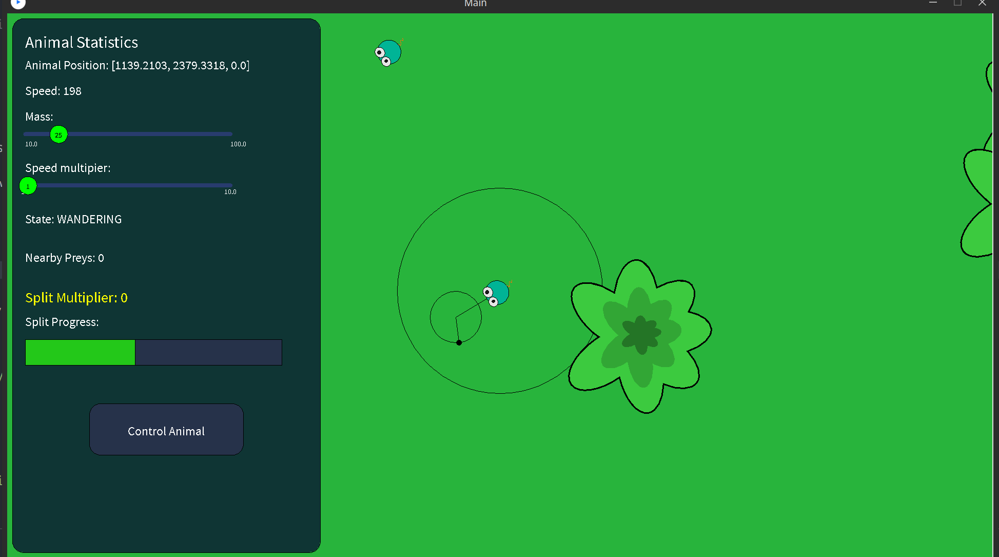
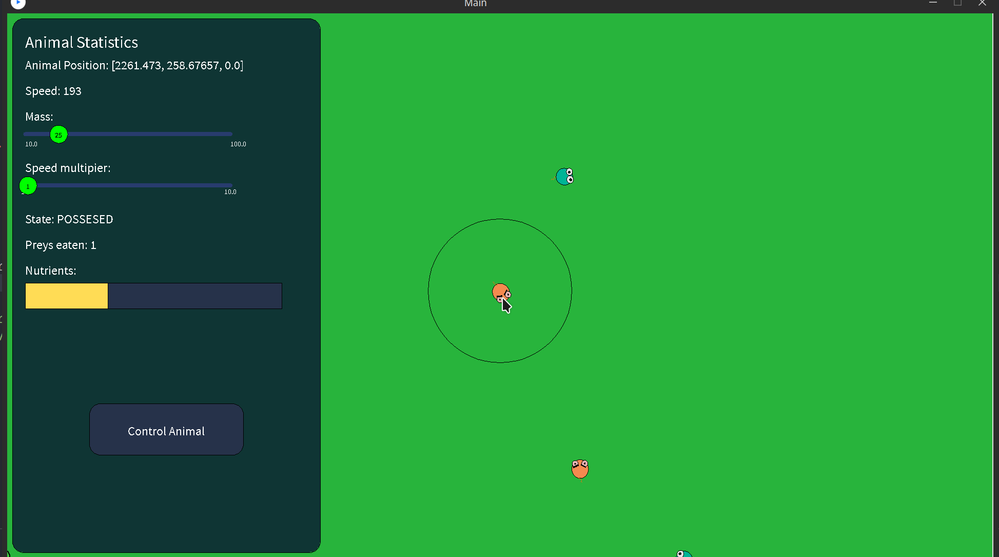
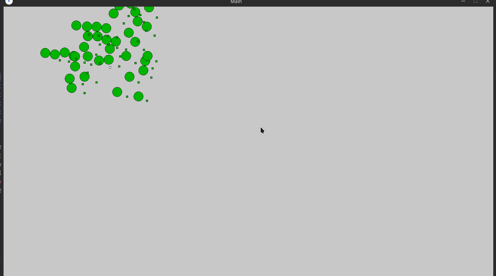

# PreyVSPredator
 School Project: Prey Vs. Predator game. Written in java with the processing API.

# Controls
`i` - toggle debug window\
`w` - move controlling animal forward\
`d` - move controlling animal right\
`s` - move controlling animal down\
`a` - move controlling animal left\

# Images
See [examples/](examples) for GIFs etc.
 

# Engine
It was built using the Entity Component System (ECS) in mind. 

The Physics System uses Quad Tree for space partitioning the scene objects:

